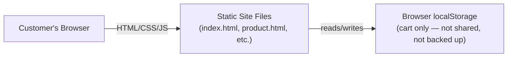
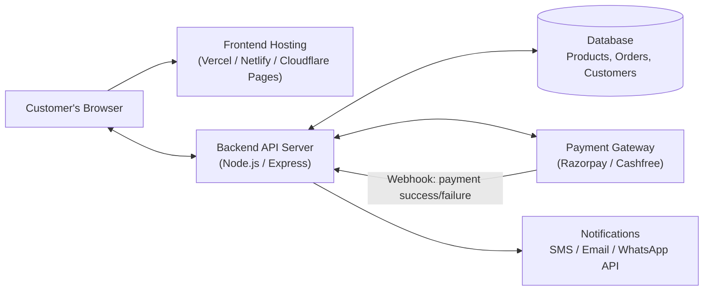

# The Apple Store Pune — Project Documentation

**Prepared for:** Client Handover / Go-Live Planning
**Prepared by:** Development Team
**Document version:** 1.0
**Last updated:** August 2026

---

## 1. Executive Summary

"The Apple Store website" is an e-commerce storefront for selling iPhone, Mac, iPad, Apple Watch, AirPods and accessories in India, styled after the Apple.com shopping experience with local (Pune) trust signals, UPI/EMI pricing and WhatsApp support.

**Current status:** The **frontend** is fully built and functional — homepage, category browsing with filters, product detail pages, cart, a multi-step checkout UI, and information pages (About, Contact, Terms). It runs as a static site (HTML/CSS/JavaScript only) with the shopping cart stored in the browser (`localStorage`).

**What's missing for a real, live, "full-stack" store:** a **backend server**, a **database**, and a **real payment gateway integration**. Right now, "Place Order" on the checkout page *simulates* payment — no real money moves and no order is saved anywhere permanently. This document explains exactly what is required — from us (development) and from **you (the client)** — to turn this into a fully working online store that can accept real payments and manage real orders.

---

## 2. What Has Already Been Built (Frontend)

| Area | Status | Notes |
|---|---|---|
| Homepage (hero banners, collections, best prices) | ✅ Done | Static content, editable in `js/data.js` |
| Category pages with filters & sorting | ✅ Done | Filters by price, category, badges |
| Product detail pages (gallery, EMI display, specs) | ✅ Done | 16 sample products included |
| Shopping cart | ✅ Done (browser-only) | Uses `localStorage`, not a database |
| Checkout flow (Contact → Shipping → Payment) | ⚠️ UI only | Payment step is **simulated** — no real gateway yet |
| WhatsApp inquiry button | ✅ Done | Needs your real WhatsApp Business number |
| About / Contact / Terms pages | ✅ Done | Contains placeholder address, phone, email |
| Search with live suggestions | ✅ Done | Searches the local product list only |
| Mobile responsive design | ✅ Done | Sticky "Add to Cart" bar on mobile |

**In short:** the *storefront experience* is ready. The *transaction backend* (real payments, real order storage, inventory, notifications) is not — that is the subject of this document.

---

## 3. Architecture — Current vs. Required

### 3.1 Current Architecture (Static Demo)

There is no server logic, no database, and no real payment processing. Everything lives in the visitor's own browser and disappears if they clear their browser data.

### 3.2 Required Full-Stack Architecture

**Why a backend is mandatory for real payments:** Payment gateways require a **secret API key** to create orders and verify signatures. That key must never be exposed in browser JavaScript (anyone could read it and forge fake "successful" payments). It must live on a server you control. This is a hard requirement of Razorpay, Cashfree, and every other Indian payment gateway.

---

## 4. What We Need From You (The Client)

Please treat this as a checklist. Items marked **[Required for launch]** are mandatory before we can go live and accept real payments.

### 4.1 Business & Legal Information — **[Required for launch]**

- [ ] Registered business name and type (Proprietorship / Partnership / Pvt Ltd)
- [ ] GSTIN (GST registration number)
- [ ] PAN card (business or proprietor)
- [ ] Business bank account details (for payment settlements — account number, IFSC, cancelled cheque or bank statement)
- [ ] Business address proof (for payment gateway KYC — utility bill, rent agreement, or Udyam/Shop Act registration)
- [ ] Authorized signatory's ID proof (Aadhaar/PAN)

*Why:* Razorpay/Cashfree legally require KYC (Know Your Customer) verification before they will let you accept live payments. This typically takes 1–3 business days once documents are submitted.

### 4.2 Payment Gateway Account — **[Required for launch]**

We recommend **Razorpay** (most popular for Indian e-commerce, supports UPI/Cards/Netbanking/No-Cost EMI). Cashfree or DotPe are viable alternatives with a similar setup.

- [ ] Create a Razorpay Business account: https://dashboard.razorpay.com/signup
- [ ] Complete KYC using the documents from section 4.1
- [ ] Enable **No-Cost EMI** in the Razorpay dashboard (requires an additional agreement — Razorpay bears/splits the interest cost with you or the bank)
- [ ] Share with us (securely, never over email in plain text):
  - [ ] **Key ID** and **Key Secret** (Test mode first, then Live mode after KYC approval)
  - [ ] **Webhook Secret** (we will help you generate this and set the webhook URL once the backend is deployed)

*Timeline:* Test-mode keys are available instantly after signup — we can build and test the entire flow before your KYC is even approved. Switch to Live keys only once you're ready to accept real money.

### 4.3 Product & Store Data — **[Required for launch]**

The demo currently ships with 16 sample products (with AI-generated placeholder images). For a real store, please provide:

- [ ] **Full product catalog** as a spreadsheet (we will provide a template) with columns: Product Name, Category, Price (MRP & Selling Price), Stock Quantity, SKU/Model Number, Color options, Storage options, Short description, Full description, Warranty period
- [ ] **Real product photos** — high-resolution (min. 1500×1500px), preferably on a plain white/transparent background, multiple angles per product if possible
- [ ] Official store name, logo (SVG or high-res PNG), and brand colors (if different from the current black/white/blue theme)
- [ ] Store address(es), operating hours, phone number, WhatsApp Business number, support email
- [ ] Shipping policy specifics: delivery areas, charges, timelines, free-shipping threshold
- [ ] Return/refund/warranty policy specifics (legal text, not just the placeholder currently in `terms.html`)
- [ ] GST invoice format/requirements (tax rates per product category)

### 4.4 Domain & Hosting — **[Required for launch]**

- [ ] A purchased domain name (e.g., `theapplestorepune.in` or `.com`) — if you don't already own one, we can help register it (~₹700–1,500/year)
- [ ] Decision on hosting provider for the backend + database. Recommended options:
  - **Frontend:** Vercel / Netlify / Cloudflare Pages (free tier is usually sufficient)
  - **Backend + Database:** Render, Railway, or a small VPS (DigitalOcean/AWS Lightsail) — approx. ₹500–2,000/month depending on traffic
- [ ] SSL certificate — automatically provided free by all recommended hosts above

### 4.5 Optional but Recommended Integrations

- [ ] **WhatsApp Business API** (via Meta or a provider like Interakt/Gupshup) for automated order confirmations — the current WhatsApp button uses the free `wa.me` click-to-chat link, which works but is manual
- [ ] **SMS/Email provider** (e.g., MSG91, SendGrid) for order confirmation & shipping notifications
- [ ] **Google Maps API key** — the current store-location map uses free OpenStreetMap; Google Maps looks more premium but requires a billing-enabled Google Cloud account
- [ ] **Google Analytics / Meta Pixel** for marketing and traffic insights

---

## 5. What We Will Build (Backend Scope)

Once the above information is available (KYC can happen in parallel with development using test-mode keys), we will build:

1. **Backend API server** (Node.js + Express) with endpoints for:
   - `GET /api/products` — serve the live product catalog
   - `POST /api/orders` — create a pending order + create a Razorpay order
   - `POST /api/payments/verify` — verify payment signature after checkout
   - `POST /api/payments/webhook` — receive Razorpay webhook events (payment captured/failed/refunded)
   - `GET /api/orders/:id` — order status lookup (for the confirmation page / order tracking)
2. **Database** to persist products, orders, and customers (recommendation: PostgreSQL or MongoDB; SQLite is acceptable for a low-traffic launch)
3. **Real payment flow**: Razorpay Checkout widget embedded in `checkout.html`, replacing today's simulated "Processing Payment..." step
4. **Order confirmation emails/SMS** (once section 4.5 credentials are provided)
5. **Basic admin view** (or a simple admin dashboard) to see incoming orders and update stock — scope to be confirmed based on budget

A minimal working version of the backend (Test-mode Razorpay, JSON-file storage) is included in this repository under `/server` so the integration can be demonstrated and tested immediately — see `server/README.md`.

---

## 6. Project Phases & Suggested Timeline

| Phase | Description | Est. Duration |
|---|---|---|
| **Phase 1** | Frontend storefront (Home, Category, PDP, Cart, Checkout UI, Info pages) | ✅ Complete |
| **Phase 2** | Client provides business/product/payment info (Sections 4.1–4.4) | 3–7 days (client-dependent) |
| **Phase 3** | Backend build: API, database, Razorpay test-mode integration | 1–2 weeks |
| **Phase 4** | End-to-end testing with test payments, real product data import | 3–5 days |
| **Phase 5** | KYC approval → switch to Live payment keys → go live | 1–3 days (gateway-dependent) |
| **Phase 6** | Post-launch monitoring, notifications setup, admin dashboard (optional) | Ongoing |

---

## 7. Security & Compliance Notes

- Card details are **never** stored on our servers — Razorpay/Cashfree handle all card data (PCI-DSS compliance is the gateway's responsibility, not ours).
- All payment secret keys will be stored as environment variables on the server, never committed to source code or exposed in the browser.
- HTTPS (SSL) is mandatory for any page that touches payments — enforced automatically by the recommended hosting providers.
- We recommend a documented **Privacy Policy** and **Refund Policy** be reviewed by a legal professional before go-live, especially regarding GST invoicing and consumer protection rules for e-commerce in India (Consumer Protection (E-Commerce) Rules, 2020).

---

### 8. Handover Checklist (For Go-Live Day)

- [ ] Domain DNS pointed to hosting provider
- [ ] Live Razorpay/Cashfree keys added to backend environment variables
- [ ] Webhook URL registered in the payment gateway dashboard
- [ ] Real product catalog imported and verified
- [ ] Store contact details, address, and WhatsApp number updated across the site
- [ ] Terms, Privacy, Shipping, and Refund policy pages reviewed and finalized
- [ ] Test order placed end-to-end with a real small-value payment and refunded
- [ ] Google Analytics / Search Console connected
- [ ] Backup/monitoring in place for the database

---

## 9. Glossary

- **KYC** — Know Your Customer; identity/business verification required by payment gateways and banks.
- **Webhook** — an automated notification the payment gateway sends to our server when a payment event happens (e.g., success, failure, refund), used to reliably confirm orders even if the customer closes their browser mid-payment.
- **No-Cost EMI** — a financing option where the bank/card issuer waives interest, usually funded by a merchant subsidy agreed with the payment gateway/bank.
- **SKU** — Stock Keeping Unit; a unique code identifying a specific product variant (e.g., iPhone 15 Pro, Blue, 256GB).
- **PCI-DSS** — Payment Card Industry Data Security Standard; compliance required to handle card data, normally offloaded entirely to the payment gateway.

---

*For the fillable version of the information request in Section 4, see `docs/CLIENT_CHECKLIST.md`.*
